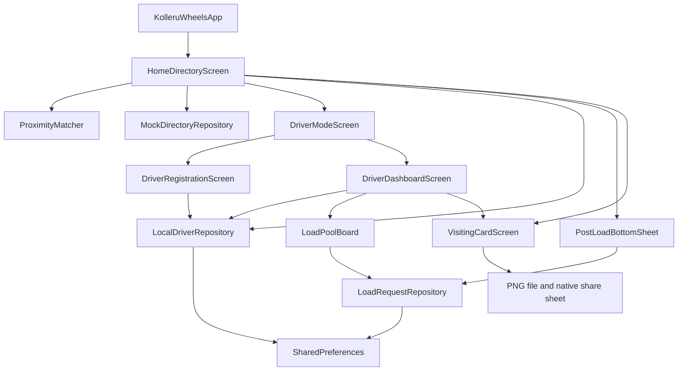

# Kolleru Wheels (కొల్లేరు వీల్స్)

Technical architecture, product rationale, implementation boundaries, and delivery roadmap.

**Current commercial behavior (7 October 2026):** Section 13 supersedes all historical zero-login, dual-role navigation, and ID-conflict driver-sync descriptions below. Login and completed registration are now mandatory; farmer and driver views are isolated.

**Architecture snapshot:** 6 October 2026. **Primary platform:** Flutter Android. **Current milestone:** Phases 1–4 plus the Supabase client integration with persistent offline caches and pending writes. Live database authorization, FCM, and field deployment remain to be verified or implemented. Section 11 describes the cloud integration and supersedes the earlier local-only workflow descriptions below.

## 1. Executive summary

Kolleru Wheels is a hyper-local, zero-commission transport directory and urgent-load bulletin board for the Kolleru Lake corridor and the Godavari–Krishna delta belt. Its initial directory covers Kaikaluru, Mandavalli, Kalidindi, and Akividu, including lake-bed and surrounding villages such as Pulaparru, Kovvadalanka, Penumakalanka, and Kolletikota.

The product addresses a practical discovery problem: commercial transport contacts sit in fragmented phone diaries; dispatch can depend on local middlemen and their cuts; vehicles return empty after deliveries; and owners must maintain utilization while meeting vehicle-finance EMI commitments. These are product hypotheses and design inputs, to be validated during the on-ground pilot rather than presented as measured outcomes.

The solution is a bulletin-style directory that makes the right vehicle and driver easy to recognize, contact, and share. Farmers and merchants browse without logging in. Drivers register a local profile, update availability and their current spot, and export a digital visiting card for WhatsApp. Urgent loads remain discoverable for 30 minutes, with callers negotiating directly outside the app.

### Why a conventional ride-hailing model is a poor default

The anti-pattern is importing an Ola/Uber/Porter-style automatic dispatch model without validating its assumptions against rural freight conditions. This is a critique of that architectural pattern, not a claim about the capabilities of those services.

| Rural constraint | Why nearest-vehicle dispatch is insufficient | Kolleru Wheels response |
| --- | --- | --- |
| Canal bunds, lake edges, narrow approaches, and indirect crossings | Straight-line distance can misrepresent a usable approach or travel route. | Use recognizable village and mandal clusters; let the parties confirm access by phone. |
| Payload, bed length, rack, and material differences | A nearby compact vehicle can be unsuitable for long TMT rods, heavy cement loads, PVC pipes, or aqua cargo. | Show model, declared capacity, specialization tags, and distinguishable silhouettes. |
| Local trust and intermittent connectivity | Automated allocation and mandatory account creation can add friction to existing phone and WhatsApp relationships. | Zero-login browsing, direct dialer handoff, offline directory data, and shareable cards. |
| Empty return trips and EMI pressure | A passenger-trip abstraction does not directly express backhauls or owner utilization needs. | Expose availability and urgent needs; plan return-trip tagging. |

The app does not promise a booking, a particular response time, verified vehicle suitability, or a guaranteed load. Its role is discovery and contact.

## 2. Target personas and UX primitives

### Persona 1: Truck owner / driver — డ్రైవర్ / యజమాని

The owner-driver needs more paid utilization, fewer empty return journeys, and a simple way to announce availability. A useful profile conveys the vehicle, capacity, specialization, base village, current spot, and contact number. The digital visiting card provides a high-status regional identity that can be placed on WhatsApp Status or forwarded to merchants.

Primary journey: Driver Mode → register once on the phone → dashboard → availability/current-spot update → view or share card → inspect urgent loads → call the shipper.

### Persona 2: Hardware / input merchant — ఆర్డర్ ఇచ్చే వ్యాపారి

The merchant is a high-volume proxy dispatcher for customers buying TMT iron rods, cement bags, PVC pipes, and aqua feed. Vehicle selection must account for cargo geometry and weight, not simply whether a truck is nearby. The merchant benefits from visual vehicle selection, capacity and specialization labels, and a quick urgent-load post when a known driver is busy.

Primary journey: choose a village and vehicle → compare available drivers → call → alternatively post a pickup, destination, material, and contact number.

### Persona 3: Farmer / rural shipper — రైతు / గ్రామస్తుడు

The intended farmer persona can be text-constrained while remaining tech-fluent through WhatsApp audio, YouTube, and UPI sound cues. Limited comfort with long text is not equivalent to limited digital ability. This persona relies on recognizable vehicle silhouettes, color plus explicit status text, short Telugu/English labels, and one-tap access to the dialer. Audio familiarity informs the design; UPI and payment audio are not app integrations.

Primary journey: recognize the appropriate vehicle → choose the locality → call a driver or post an urgent need with minimal typing.

### Shared UX principles

- **Zero-login browsing:** `HomeDirectoryScreen` is the launch screen. Driver Mode is optional. Local registration is not authenticated login or phone verification.
- **Visual recognition:** offline `CustomPainter` illustrations distinguish Bolero Pickup, Tata Ace, Dost, Eicher 14 ft, and Tractor. Model and capacity labels remain visible.
- **Outdoor contrast:** primary green `#00875A`, warning amber `#FFC107`, deep charcoal `#202B28`, and dashboard busy red `#D9383A`. Status always includes text and/or an icon rather than relying on color alone.
- **Large touch targets:** shared button themes provide 56–60 logical-pixel minimum heights; prominent call, registration, posting, and sharing actions use 64-pixel minimum heights. Vehicle badges appear at 88–120 pixels in major screens.
- **Bilingual copy:** centralized strings pair Telugu and English. UTF-8 source files preserve Telugu characters. Current localization is embedded bilingual copy, not a language-switching localization framework.
- **Offline first launch:** static villages, seeded drivers, local profiles, vector badges, and system-font Telugu fallback do not require asset downloads. Google Fonts is installed but not used by the current theme.
- **Direct contact:** `url_launcher` receives a `tel:` URI and delegates calling to the platform dialer. A dialer failure produces a recoverable message. Demo numbers display a notice instead of launching a call.
- **Accessibility:** layouts adapt to narrow screens and larger text. `AudioCueButton` uses Flutter semantic announcements when supported; spoken output depends on an enabled screen reader such as TalkBack. It is not standalone text-to-speech or a recorded-audio system.

## 3. Architecture overview and decisions

The project uses a lightweight layered architecture: shared constants/theme and matching utilities under `core`, models and storage under `data`, and screens/widgets under `presentation`. It follows separation-of-responsibility principles while deliberately avoiding unnecessary framework complexity at this milestone.

It is not yet a strict domain-isolated Clean Architecture implementation. Presentation imports repositories directly, `ProximityMatcher` consumes a data model, and the directory contract currently lives beside the mock implementation. Introducing a separate domain layer and backend-facing interfaces is a planned evolution when remote synchronization is implemented.



### Architectural decision register

| Decision | Reason | Consequence / boundary |
| --- | --- | --- |
| Bulletin and direct-contact model | Preserve familiar local negotiation and minimize transaction complexity. | No fares, commissions, automatic bookings, payment workflow, or allocation guarantee. |
| Static village IDs and mandal membership | Deterministic offline grouping and durable references. | Cluster definitions need pilot validation and versioned migration if IDs change. |
| Separate persisted and display driver models | Persist structured fields while reusing existing cards. | `LocalDriverProfile.toDriverModel()` is the display adapter. |
| `StatefulWidget` and `setState` for screen state | Keep small workflows explicit without adding a state-management dependency. | Repositories own storage; screens own loading, error, and operation states. |
| `ChangeNotifier` for the local load pool | Farmer and driver views need immediate updates after successful writes. | The default singleton is shared within this app process, not across devices. |
| SharedPreferences JSON storage | Small, easily testable local records with no backend prerequisite. | No transactional database, encrypted vault, authenticated identity, or synchronization. |
| Serialized storage operations | Avoid overlapping read-modify-write operations losing state. | Driver writes serialize across repository instances in one isolate; load writes serialize within one repository instance. |
| Stable three-tier matching | Make grouping predictable and explainable. | No GPS, road-distance routing, or learned ranking; order within a tier follows repository order. |
| `CustomPainter` vehicle badges | Offline, crisp, high-contrast silhouettes without image downloads. | Illustrations communicate vehicle classes, not verified manufacturer specifications. |
| Rasterize a self-contained visiting card | Produce an image that works in existing social-sharing workflows. | The user chooses the destination in the native share sheet. |
| Clock injection and explicit TTL | Make exact expiry behavior testable. | Current production timestamps depend on the device clock; server authority is deferred. |

## 4. Complete folder tree and component roles

The following tree lists every current application Dart source and test file. Platform and generated directories are represented at their root; their generated contents are not application architecture modules.

```text
kolleru-wheels/
├── ARCHITECTURE.md
├── README.md
├── pubspec.yaml
├── pubspec.lock
├── analysis_options.yaml
├── .gitignore
├── .metadata
├── kolleru_wheels.iml
├── lib/
│   ├── main.dart
│   ├── core/
│   │   ├── constants/
│   │   │   ├── app_colors.dart
│   │   │   ├── app_strings.dart
│   │   │   ├── driver_spots.dart
│   │   │   ├── supabase_config.dart
│   │   │   └── villages.dart
│   │   ├── theme/
│   │   │   └── app_theme.dart
│   │   └── utils/
│   │       └── proximity_matcher.dart
│   ├── data/
│   │   ├── models/
│   │   │   ├── driver_model.dart
│   │   │   ├── load_request.dart
│   │   │   ├── load_request_model.dart
│   │   │   ├── local_driver_profile.dart
│   │   │   ├── user_profile_model.dart
│   │   │   └── vehicle_type.dart
│   │   └── repositories/
│   │       ├── auth_repository.dart
│   │       ├── load_request_repository.dart
│   │       ├── local_driver_repository.dart
│   │       ├── mock_directory_repository.dart
│   │       ├── offline_table_store.dart
│   │       ├── supabase_driver_repository.dart
│   │       ├── supabase_load_request_repository.dart
│   │       └── telemetry_repository.dart
│   └── presentation/
│       ├── admin/
│       │   └── admin_dashboard_screen.dart
│       ├── auth/
│       │   ├── complete_profile_screen.dart
│       │   ├── phone_otp_screen.dart
│       │   ├── session_router.dart
│       │   └── role_destination.dart
│       ├── common/
│       │   ├── audio_cue_button.dart
│       │   ├── call_button.dart
│       │   ├── mandal_village_picker.dart
│       │   ├── vehicle_badge.dart
│       │   └── village_picker.dart
│       ├── driver/
│       │   ├── driver_dashboard_screen.dart
│       │   ├── driver_mode_screen.dart
│       │   ├── driver_registration_screen.dart
│       │   ├── load_pool_board.dart
│       │   └── visiting_card_screen.dart
│       └── farmer/
│           ├── home_directory_screen.dart
│           └── post_load_bottom_sheet.dart
├── supabase/
│   └── migrations/
│       ├── 202610060001_auth_and_telemetry.sql
│       ├── 202610070001_profile_completion.sql
│       └── 202610070002_commercial_gating.sql
├── test/
│   ├── auth_and_telemetry_test.dart
│   ├── driver_onboarding_test.dart
│   ├── drawer_navigation_test.dart
│   ├── load_request_test.dart
│   ├── onboarding_helpers.dart
│   ├── proximity_and_load_request_test.dart
│   ├── proximity_matcher_test.dart
│   ├── supabase_repository_test.dart
│   ├── visiting_card_test.dart
│   └── widget_test.dart
├── android/                      # Primary deployment platform
├── ios/                          # Flutter platform scaffold
├── linux/                        # Flutter platform scaffold
├── macos/                        # Flutter platform scaffold
├── web/                          # Flutter platform scaffold
├── windows/                      # Flutter platform scaffold
├── .git/                         # Version-control metadata
├── .idea/                        # Local IDE metadata
├── .dart_tool/                   # Generated tooling state
├── .flutter-plugins-dependencies # Generated plugin metadata
└── build/                        # Generated builds and optional test previews
```

### Core modules

| File | Responsibility |
| --- | --- |
| `lib/main.dart` | Runs `KolleruWheelsApp`, sets the app title and accessible theme, disables the debug banner, and opens the farmer directory. |
| `core/constants/app_colors.dart` | Defines shared outdoor colors and the dashboard busy state. |
| `core/constants/app_strings.dart` | Centralizes bilingual labels, validation/error copy, proximity headings, specialization/material choices, and sharing text. Some dynamic labels remain in widgets. |
| `core/constants/villages.dart` | Defines `Village`, `Mandal`, immutable static clusters, a flattened list, and ID lookup through `KolleruVillages.find()`. |
| `core/constants/driver_spots.dart` | Associates display spot labels with village IDs, including Kaikaluru Adda and Akividu Market, plus ordinary village locations. |
| `core/theme/app_theme.dart` | Configures Material 3, contrast, typography, form decoration, and large filled/outlined button styles using system fonts. |
| `core/utils/proximity_matcher.dart` | Defines `ProximityTier`, `ProximityMatch`, village-to-mandal lookup, tier classification, deduplication, and deterministic ranking. |

### Data modules

| File | Responsibility |
| --- | --- |
| `data/models/vehicle_type.dart` | Enum for `boleroPickup`, `tataAce`, `dost`, `eicher14ft`, and `tractor`, with bilingual display labels. Enum names are stored as stable identifiers. |
| `data/models/driver_model.dart` | Directory/card projection: ID, name, phone, base village, current-spot label and optional village ID, vehicle type, display capacity, availability, demo flag, vehicle number, and specializations. |
| `data/models/local_driver_profile.dart` | Structured persistent driver profile with numeric capacity in tons, base/current villages, spot label, JSON serialization/validation, immutable specialization list, selective `copyWith()`, and conversion to `DriverModel`. |
| `data/models/load_request_model.dart` | Active urgent-load contract with open/closed status, serialization, destination validation, and the exact 30-minute lifetime predicate. |
| `data/models/load_request.dart` | Earlier scaffold model containing origin/destination `Village` objects and basic contact/material fields. Retained in the tree but unused by the urgent-load workflow; do not confuse it with `LoadRequestModel`. Consolidation is future cleanup. |
| `data/repositories/mock_directory_repository.dart` | Declares `DirectoryRepository` and implements immutable seeded driver retrieval with optional filters. Six demo records span Pulaparru, Kaikaluru Town, and Kovvadalanka; four are available, two busy, and all five vehicle classes appear. Numbers and plates are placeholders. |
| `data/repositories/local_driver_repository.dart` | Saves/reads/updates one registered profile in SharedPreferences; serializes writes, validates profile identity for full updates, and offers availability/current-spot field updates. |
| `data/repositories/load_request_repository.dart` | Lazily restores a local load list, caches it in memory, serializes operations, creates/closes requests, filters active loads, sorts newest first, and notifies listeners after successful persistence. |

### Presentation modules

| File | Responsibility |
| --- | --- |
| `presentation/common/vehicle_badge.dart` | Draws five distinctive offline vehicle silhouettes: Bolero rack/TMT rods; Tata Ace snub cab and compact bed; Dost broad bumper and medium cargo body; tall Eicher cab/railing; tractor bonnet, large rear wheel, and trailer. |
| `presentation/common/call_button.dart` | Shared large green contact control, repeated-tap protection during launch, dialer-error handling, and demo-record notice. |
| `presentation/common/audio_cue_button.dart` | Screen-reader announcements plus visible guidance; no standalone audio playback dependency. |
| `presentation/common/village_picker.dart` | Reusable base-village form dropdown with mandal context and required-selection validation. |
| `presentation/farmer/home_directory_screen.dart` | Zero-login entry point; saved village selection, visual vehicle filters, availability filter, proximity sections, demo plus locally registered drivers, direct call controls, visiting-card navigation, Driver Mode drawer/action, and urgent-load launcher. |
| `presentation/farmer/post_load_bottom_sheet.dart` | Keyboard-aware bilingual form for pickup, destination, material, optional vehicle requirement/name, shipper phone, validation, and asynchronous posting. |
| `presentation/driver/driver_mode_screen.dart` | Resolves the persisted profile once per visit, showing registration if absent, dashboard if present, or a retry screen on storage/decode failure. |
| `presentation/driver/driver_registration_screen.dart` | Collects identity/contact, registration number, capacity, visual vehicle selection, village, and specialization chips; persists before dashboard transition. |
| `presentation/driver/driver_dashboard_screen.dart` | Shows the registered driver, large availability switch, editable current spot, digital-card access, Farmer View navigation, and `LoadPoolBoard`. |
| `presentation/driver/load_pool_board.dart` | Observes repository changes and app resume; shows route/material/elapsed time/call cards, empty/error/loading states, and schedules refreshes around minute boundaries and expiry. |
| `presentation/driver/visiting_card_screen.dart` | Contains the opaque `TransportVisitingCard`, contact and share actions, `RepaintBoundary` capture, temporary PNG lifecycle, native sharing, and error recovery. |

### Geographic directory inventory

There are **26 village/locality entries in four directory clusters**:

| Mandal cluster | Entries |
| --- | --- |
| Kaikaluru | Kaikaluru Town, Kovvadalanka, Gudivakalanka, Atapaka, Bhujabalapatnam, Pallevada, Kolletikota, Alapadu, Singarayapalem |
| Mandavalli | Mandavalli, Chintapadu, Pulaparru, Penumakalanka, Prathikollalanka, Lokamudi, Ingilipakalanka |
| Kalidindi | Kalidindi, Sanrudraram, Guraja, Korukollu, Pothumarru |
| Akividu | Akividu Town, Dumpagadapa, Taratava, Ajjamuru, Kolleru border hamlets |

These are the supplied product directory clusters, not a certified administrative boundary dataset. “Kolleru border hamlets” is a catch-all locality, not one official village. Validate spellings, Telugu names, cluster membership, hub labels, and accessible road connections with local participants before publishing geographic claims.

### Dependency inventory

| Package / constraint | Current role |
| --- | --- |
| Flutter SDK; Dart `^3.13.5` | Widgets, Material UI, painting, image capture, semantics, and app lifecycle. |
| `url_launcher: ^6.2.5` | Opens `tel:` contact URIs. |
| `shared_preferences: ^2.2.3` | Local profile, selected village, and urgent-load JSON records. |
| `share_plus: ^10.1.2` | `Share.shareXFiles()` native image-sharing handoff. |
| `path_provider: ^2.1.5` | App temporary directory for exported visiting-card images. |
| `google_fonts: ^6.2.1` | Installed for potential typography work; unused by the current offline system-font theme. |
| `flutter_svg: ^2.0.10+1` | Installed for potential SVG assets; current badges use `CustomPainter`. |
| `cupertino_icons: ^1.0.8` | Retained starter dependency; main UI uses Material icons. |
| `flutter_test` and `flutter_lints: ^6.0.0` | Unit/widget verification and static-analysis rules. |

Caret constraints are declared requirements, not exact resolved versions. `pubspec.lock` records the dependency versions used by this application build. Native platform registrants are generated by Flutter.

## 5. Data contracts, persistence, and state ownership

### SharedPreferences records

| Key | Encoding | Owner |
| --- | --- | --- |
| `directory_village_id` | Village ID string; removed for “All villages”. | `HomeDirectoryScreen` |
| `registered_driver_profile_v1` | One JSON object with `schemaVersion: 1`. | `LocalDriverRepository` |
| `urgent_load_requests_v1` | JSON array of urgent-load records. | `LoadRequestRepository` |

**Registered driver fields:** `id`, `name`, `phone`, `baseVillage`, `currentSpotVillage`, `currentSpotLabel`, `vehicleType`, `capacityTons`, `specializations`, `vehicleNumber`, and `isAvailable`. Village objects are serialized as village IDs. The label allows a hub such as Kaikaluru Adda to retain its identity while ranking against `kaikaluru-town`.

**Urgent-load fields:** `id`, `posterName`, `posterPhone`, `fromLocation`, `toVillage`, `materialType`, nullable `vehicleTypeNeeded`, `createdAt`, and `isClosed`. The model exposes the destination as a `Village` and serializes it as a stable village ID. Compatibility accessors/JSON fields retain `toVillageId` and `status` (`open`/`closed`), and older persisted records still decode. `createdAt` is serialized as UTC ISO 8601. A null vehicle requirement means any vehicle. Pickup is a free-text spot, not a structured village or GPS coordinate.

Registration requires a name of at least two trimmed characters, a normalized Indian mobile number, a conventional vehicle-registration format, a selected village, and finite capacity greater than zero and at most 100 tons. These validations check input shape; they do not verify ownership, registration validity, road fitness, or permissible payload. Specializations are optional selections: iron rods, cement, live fish, and paddy.

Posting validates pickup, destination, and mobile number. A missing shipper name becomes “రైతు / Shipper”; material defaults to the first choice. Supported material chips are iron/rods, cement, pipes, fish feed, and miscellaneous goods.

### State and failure behavior

Screen-local state uses `setState`; asynchronous callbacks check whether their widget is still mounted. Operation flags suppress repeated submissions and simultaneous dashboard updates. The dashboard changes its displayed profile only after successful persistence; a failed availability update preserves the previous value and displays a retry message.

`LocalDriverRepository` uses a static write queue across its instances within the current isolate. Partial updates read the latest profile inside the queued operation. `LoadRequestRepository` serializes reads and writes per instance and publishes changes after committing the JSON record. The default shared instance is the application’s load-pool owner; independently constructed instances have independent caches and queues and are not a cross-instance consistency mechanism.

Malformed stored JSON is surfaced as an error rather than treated as a missing profile/pool or silently overwritten. Driver Mode and the board expose retry states. There is no recovery/export/delete-data UI yet. Local IDs support this prototype; backend identity and conflict-resolution policies remain to be designed.

## 6. Key technical workflows

### 6.1 Driver onboarding and dashboard navigation

1. The directory’s Driver Mode action/drawer entry opens `DriverModeScreen` without blocking farmer browsing.
2. `getProfile()` resolves the saved driver. A missing profile opens registration; a valid profile opens the dashboard. Read failures show a retry screen.
3. Registration initializes current spot to the base village and availability to true, normalizes contact data, and saves the complete profile before transitioning.
4. Within Driver Mode, the registration callback swaps the displayed screen without adding an extra route. A standalone registration screen can replace its route with the dashboard.
5. Availability calls `updateAvailability()`. The spot chooser calls `updateCurrentSpot()` with a village and optional hub label. Base village remains unchanged.
6. The current profile is adapted to `DriverModel` when opening the visiting card.
7. Farmer View opens the directory with the shared repositories. Its Driver Mode action returns to the dashboard. Returning to the original directory refreshes the local profile.

The current workflow manages one local driver profile on a phone. It does not create a remotely discoverable account or authenticate the entered phone number.

### 6.2 Three-tier proximity matching engine

`ProximityMatcher.match(drivers, selectedVillage)` returns an immutable `ProximityResult` containing `tier1`, `tier2`, and `tier3` driver lists. The existing `rank(drivers, selectedVillageId)` API remains compatible. Both assign available drivers to the best qualifying tier:

| Priority | Tier | Predicate | Directory heading |
| --- | --- | --- | --- |
| 1 | Same village / Local | Current-spot village **or** base village equals the selected village. | మీ ఊరిలోనే ఉన్న వాహనాలు (In your village) |
| 2 | Same mandal / Mandal hub | No Tier 1 match; current-spot village **or** base village belongs to the selected village’s mandal cluster. | మండల కేంద్రంలో అందుబాటులో ఉన్నవి (In Mandal hub) |
| 3 | Adjacent-mandal product concept / Delta belt | No higher-tier match; a known base/current village is in another supported Kolleru cluster. | చుట్టుపక్కల మండలాలు (Nearby Mandals) |

Current Tier 3 is a **wider-belt fallback**, not an explicit map of adjacent mandal boundaries. Tier 2 establishes same-cluster membership, not proof that a vehicle is parked at the mandal’s administrative center. Labels should be interpreted as discovery groupings; actual location is shown separately.

Classification uses stable village IDs. Free-text labels are not parsed to infer geographic location. Missing/unknown current IDs fall back to the base village. An unknown selected village yields no matches. Unavailable drivers are excluded from the matcher. IDs are deduplicated, and repository order is preserved within a tier. A moved driver can still be Tier 1 through its base village because that is the specified matching rule; the displayed current spot lets the caller confirm actual proximity.

When a village is selected, the directory retrieves vehicle-filtered candidates across the belt and renders the ranked available sections. Busy drivers appear in a separate section if “Available only” is off. Without a selected village, the ordinary directory view remains available. The locally registered profile is included alongside demo records.

Example: for **Kovvadalanka**, an available Kovvadalanka tractor is Tier 1; an available Kaikaluru Town truck is Tier 2; an available Pulaparru pickup is Tier 3. A busy Kovvadalanka vehicle is shown only in the separate busy section.

No vehicle is automatically assigned. Caller and driver must confirm access, capacity, rack compatibility, material suitability, current availability, and commercial terms.

### 6.3 Digital visiting-card PNG generation pipeline

```text
LocalDriverProfile.toDriverModel() or directory driver
  → TransportVisitingCard (opaque, self-contained card)
  → RepaintBoundary + GlobalKey
  → endOfFrame and RenderRepaintBoundary.toImage(pixelRatio)
  → ui.Image.toByteData(format: ui.ImageByteFormat.png)
  → path_provider.getTemporaryDirectory()/kolleru_cards/
  → PNG file + XFile(mimeType: image/png)
  → Share.shareXFiles()
  → native share sheet → user chooses WhatsApp → My Status
```

The exported card includes the “కొల్లేరు వీల్స్ / Kolleru Wheels” header/emblem, large driver name, vehicle silhouette/model, vehicle number, capacity, specialization badges, base village, current spot, availability, and contact banner. Demo records include a placeholder notice. Calling/sharing controls sit outside the boundary and are excluded from the image.

Capture waits for a rendered frame and checks the boundary is ready. Its scale targets 1080-pixel width, capped at 3× and approximately four million pixels to limit memory use on inexpensive phones. The PNG is written and flushed before sharing. The share operation passes a source rectangle for platform popover anchoring. Repeated share taps are blocked while the image is prepared, errors are surfaced, and the `ui.Image` is disposed in `finally`.

Only the app’s exported PNG files older than one day are cleaned during a subsequent export. Recent files remain available to the recipient app after the share sheet closes. This is opportunistic cleanup, not a guaranteed scheduled deletion service.

The accompanying text is: “నా కొల్లేరు వీల్స్ విజిటింగ్ కార్డ్. రవాణా అవసరాలకు సంప్రదించండి.” The image-share implementation does not force-open WhatsApp or automatically publish a Status. Posting remains the user’s action inside the recipient application.

### 6.4 Urgent-load creation and live pool

1. The farmer taps **అత్యవసర లోడ్ / Post Urgent Load** in the directory.
2. A keyboard-aware bottom sheet accepts a pickup spot or quick chip (“కైకలూరు మార్కెట్”, “దుకాణం వద్ద”), a destination village, material, optional required vehicle and name, and a shipper phone number. The selected directory village can prefill the destination.
3. Validation runs before `createRequest()`. A new request starts `open`, using the repository clock for creation time.
4. The repository retains currently active records plus the new record, writes JSON, updates its memory cache, and notifies subscribers only after the write succeeds.
5. The sheet closes on success and the directory shows confirmation. A failed write keeps the form available with an error.
6. `LoadPoolBoard` reads active requests newest first and displays route, material icon/type, requested vehicle when specified, shipper name, elapsed time, and a large Call Shipper button.

The default pool is shared by farmer and driver views **on this phone**. The dashboard filters active requests whose destination village belongs to the driver's operational mandal, determined from the current-spot village with base-village fallback. The board labels this as loads delivering to the current mandal and refreshes when that mandal changes. `getActiveRequests(operationalMandalId: ...)` supplies this filter; omitting it returns the full active local pool. Pickup proximity and vehicle eligibility are not filtered. Destination is structured but pickup is free text, so reliable pickup-based matching requires a future structured origin field. Entering a vehicle requirement informs the driver but does not automatically allocate or enforce a match.

### 6.5 Thirty-minute TTL and lifecycle

The active predicate is:

```text
isClosed == false
AND createdAt <= now
AND now < createdAt + 30 minutes
```

A request is active at 29 minutes 59 seconds and expired at exactly 30 minutes. Closed and future-dated records are excluded. The clock is injectable for deterministic tests; production currently uses the device clock.

`getActiveRequests()` applies the predicate on every read and returns an immutable newest-first list. `closeRequest(id)` persists the closed state; an unknown ID is a no-op. Closing a request is a repository capability, not currently a farmer-facing completion button. Expiration is computed, not stored as a third status.

The board schedules a timer for the earliest of the next elapsed-minute label boundary or request expiry, rechecks on app resume, and filters again at build time. It cancels timers and unregisters listeners on disposal. A revision counter prevents older asynchronous refreshes from overwriting newer results. No permanent periodic timer runs when the pool is empty.

Expiration hides a record immediately when it is read/refreshed; it does **not** immediately delete its persisted bytes. Creating a new request prunes inactive entries from the stored list. Closing alone can retain older records. A production retention/erasure policy and server-authoritative timestamps belong to the backend/database roadmap.

## 7. Compliance and security boundaries

### Intermediary discovery scope

The intended product boundary is pure intermediary discovery: publish contact/profile information and short-lived load notices, then let the parties communicate directly. The current app does not set fares, calculate commissions, hold escrow, collect payments, integrate UPI transactions, broker an in-app contract, or guarantee fulfillment. These are explicit architectural exclusions and should be preserved when adding a backend.

This product boundary is not a regulatory classification or legal exemption. Avoiding transactional features and government-document collection reduces the data and operational scope; it does not eliminate all regulatory or PII responsibility.

### Data minimization

- Do not add Aadhaar or other government-ID numbers/images, driving-license scans, RC documents/scans, bank details, payment credentials, or identity-document upload fields to the current workflow.
- A vehicle registration **number** is collected for the visiting card; the RC document itself is not stored. Names, phone numbers, registration numbers, village/spot information, and load descriptions still require careful handling.
- Location is manually selected at village/hub level. There is no background GPS tracking, route history, or continuous driver surveillance.
- Demo records must remain visibly marked; their placeholder numbers must not be dialed or presented as verified participants.
- Shared images intentionally include contact details. The UI should make that disclosure clear; external recipients can retain or forward the image outside the app’s control.

### Platform and storage boundaries

`tel:` launching delegates contact to the dialer; the main Android manifest does not request `CALL_PHONE`. The app also does not request contacts, SMS, or location access in that manifest. The exact resolved plugin behavior and complete merged release manifest should be inspected before an APK is distributed.

SharedPreferences is local persistence, not an encrypted PII vault or an identity authority. No remote authentication, moderation, account ownership proof, server authorization, or notification subscription consent is implemented. Treat local validation as input validation only.

Before shared production publication, design explicit contact-publication consent, access rules, deletion and retention handling, abuse reporting, rate limits, and moderation. Keep phone numbers and full profiles out of diagnostic logs and notification payloads unless necessary and intentionally authorized. Do not place service credentials or server messaging keys in the APK.

## 8. Roadmap and progress matrix

“Completed” below refers to the implemented and tested local scope, not a production launch or measured field adoption.

| Phase | Status | Delivered / intended scope | Remaining exit criteria |
| --- | --- | --- | --- |
| Phase 1 — Scaffold & Static Village Directory | Completed | Layered folder structure, models, four clusters/26 localities, six demo drivers, bilingual theme and directory. | Validate locality spellings, memberships, and navigation with pilot users. |
| Phase 2 — Realistic Badges, Dialer CTA, WhatsApp PNG Exporter | Completed | Five painter badges, large contact controls, detailed visiting card, PNG capture and native sharing. | Verify dialer/share behavior, Telugu glyphs, and WhatsApp Status on target Android phones. |
| Phase 3 — Driver Registration, Persistence, Availability Toggle | Completed | One local profile, form validation, saved availability/spot, returning-driver routing, Farmer View integration. | Define remote identity, profile editing/deletion, consent, and sync behavior for backend publication. |
| Phase 4 — 3-Tier Proximity Engine & Urgent Load Pool | Completed locally / In progress for production | Available-driver tier sections, urgent posting, persisted shared local pool, 30-minute expiry, live local refresh and calls. | Validate adjacency/access assumptions; implement cross-device distribution, authoritative expiry, moderation, and structured origin matching. |
| Phase 5 — Free-tier Backend & FCM Broadcast | Planned | Evaluate a low-cost/free-tier-capable backend; shared directory/load storage; controlled mandal topic notifications. | Choose provider using current quotas and projected usage; implement authorization, timestamps, TTL filtering, consent, retries, and monitoring. No provider or cost guarantee is committed. |
| Phase 6 — APK Generation & On-Ground Pilot | Planned | Release signing/build, installation, and field trials across merchants, owners, and farmers. | Verify release configuration, permissions, physical-device behavior, outdoor readability, weak connectivity, route access, and user comprehension. |

The initial code verification preceding this document passed `flutter analyze` with no issues and `flutter test` with **28 passing tests**. The subsequent Phase 4 API and operational-mandal filtering changes add regression coverage in `test/proximity_and_load_request_test.dart`; run the full suite for the current count. These checks validate local behavior, not cross-device load delivery, actual WhatsApp publication, or field performance.

## 9. Future optimizations and production evolution

### SQLite / Drift offline caching

Replace whole-list preferences storage with a structured offline database when data volume or synchronization warrants it. Use explicit profile/request tables, stable IDs, schema migrations, indexed village/mandal/vehicle/status/expiry columns, and a durable outbox for pending writes. Keep SharedPreferences for lightweight UI preferences. Query active rows by authoritative expiry and maintain a separate retention cleanup policy. A database migration must preserve the existing profile and urgent-load keys without silently losing local data.

### Low-budget FCM topic broadcasting

Planned topic convention: `topic_mandal_<name>`, for example `topic_mandal_kaikaluru`, `topic_mandal_mandavalli`, `topic_mandal_kalidindi`, and `topic_mandal_akividu`.

Users should explicitly choose subscriptions, with unsubscribe behavior when their preferences change. A trusted backend should validate and store each load before broadcasting a minimal request reference and expiry. Publish from a server, never from credentials embedded in the client. Opening a notification must fetch/recheck request status and TTL; a delayed or duplicate push must not resurrect a closed/expired load. Set delivery lifetime no longer than the remaining request TTL, deduplicate by request ID, rate-limit abuse, and avoid unnecessary personal data in lock-screen payloads.

FCM topics are delivery channels, not authorization boundaries or exact proximity matching. Evaluate provider limits and actual pilot usage before selecting a free-tier strategy; “low budget” is a design target, not a guarantee of zero operating cost. FCM, remote storage, permissions, and notifications are not currently wired into this application.

### Return-trip discount tagging — తిరుగు ప్రయాణం

Introduce a driver-declared return-trip tag, origin/destination corridor, optional departure window, and expiry. Show it as an opportunity for a negotiated backhaul rather than calculating or imposing a fare. Keep return-trip availability distinct from general availability, and validate cargo/access compatibility through the same direct-contact workflow. The tag is planned; there is no return-trip field or pricing engine in the current models.

### Additional architectural follow-through

- Introduce domain interfaces for driver profiles, directory queries, and load requests before adding remote implementations; preserve constructor injection for tests.
- Add structured pickup village/hub IDs, locally verified neighboring-cluster relationships, and road-access metadata without implying GPS precision.
- Establish last-confirmed availability timestamps and stale-profile indicators when profiles become shared across devices.
- Define conflict resolution, operation IDs, backend timestamps, pagination, and retry/outbox behavior for unreliable connectivity.
- Consolidate the older `LoadRequest` scaffold model into the active contract after checking migration needs.
- Validate Telugu wording and fonts on target devices; bundle a suitably licensed offline Telugu font if OS fallback proves inconsistent.
- Add searchable village/spot selection and optional standalone Telugu speech only after field evidence supports those changes.

## 10. Verification and release operations

Run the standard local checks from the repository root:

```sh
flutter pub get
flutter analyze
flutter test
```

| Test file | Coverage |
| --- | --- |
| `test/widget_test.dart` | Directory seed/filter behavior, village integrity, visiting-card navigation, three proximity sections, and narrow-screen text scaling. |
| `test/visiting_card_test.dart` | All five badges at small display size, PNG signature/full-card capture, card fields, narrow-screen enlarged text, and demo-call protection. |
| `test/driver_onboarding_test.dart` | Registration and validation, persisted fields, restart routing, concurrent partial updates, location/availability, Farmer View, corrupt data, save-failure preservation, and retry. |
| `test/proximity_matcher_test.dart` | Tier precedence from current/base village, same-mandal grouping, wider-belt fallback, stable/deduplicated order, unavailable/unknown cases, and all village-to-mandal mappings. |
| `test/proximity_and_load_request_test.dart` | Immutable structured tier results, deduplication, legacy/new request serialization, boolean closure, exact TTL, destination-mandal filtering, and board updates when operational mandal changes. |
| `test/load_request_test.dart` | Exact expiry boundary, restored/closed/future records, newest-first order, concurrent creation, invalid/corrupt data, live expiry removal, posting validation/persistence, and enlarged-text/keyboard layout. |

Setting `KOLLERU_RENDER_PREVIEWS=1` for the visiting-card tests writes optional PNGs under `build/previews/`. Widget-test fonts are not representative of the final phone’s Telugu typography; physical-device visual checks remain necessary.

On the current Windows development machine, Flutter plugin-link creation encountered disabled symlink support. Local directory junctions in the generated Windows plugin-link directory allowed dependency resolution without changing system settings. This is an environment accommodation, not an Android feature or a portable source dependency; a fresh checkout must provision its own supported Flutter/plugin environment.

For the planned Android release, configure signing securely and review the merged manifest and dependency requirements before generating an APK. `flutter build apk --release` is the intended build command after release configuration is ready; release APK generation and on-ground installation are not completed milestones in this snapshot. Retained desktop/iOS/web scaffolds do not imply those platforms have been validated; the PNG exporter uses `dart:io` and currently targets native mobile execution.

Pilot acceptance should include outdoor use on inexpensive phones, 2× text settings, Telugu rendering, keyboard-visible posting, no-network local browsing, app restart and resume, exact expired-load hiding, dialer handoff, real WhatsApp Status sharing, clear demo/local-only labeling, and participants’ understanding that arrangements are confirmed directly by phone.

## 11. Supabase client integration and offline synchronization

Phase 5 is now **in progress**: Supabase client integration is implemented; authenticated ownership, database policy verification, authoritative server expiry, FCM broadcasts, and field validation remain outstanding. The earlier local workflow descriptions apply when cloud configuration is absent. No production credentials or database policy changes are included in this repository change.

### Configuration and startup

`core/constants/supabase_config.dart` reads `SUPABASE_URL` and `SUPABASE_ANON_KEY` through `String.fromEnvironment`. Both default to empty values, keeping unconfigured builds usable offline. Supply the project's public anon/publishable client key:

```powershell
flutter run --dart-define=SUPABASE_URL=https://YOUR_PROJECT.supabase.co --dart-define=SUPABASE_ANON_KEY=YOUR_PUBLIC_CLIENT_KEY
```

`main.dart` initializes Flutter bindings, conditionally awaits `Supabase.initialize`, and installs `SupabaseLoadRequestRepository` as the shared load repository. Initialization failure preserves local browsing. The resolved SDK accepts the public key through `publishableKey`; the environment name remains `SUPABASE_ANON_KEY` for compatibility. Never embed a service-role key. Android's main manifest includes `INTERNET` for release networking.

Dependencies added: `supabase_flutter: ^2.8.0`, `uuid: ^4.5.1`; HTTP request mocks use the development dependency `http: ^1.6.0`. Exact installed versions are recorded in `pubspec.lock`.

### Repository responsibilities and cloud contracts

| Module | Responsibility |
| --- | --- |
| `offline_table_store.dart` | SharedPreferences JSON snapshots and persistent pending-write lists; serialized repository operations; deterministic UUID migration for legacy IDs. |
| `supabase_driver_repository.dart` | Maps driver rows, fetches available drivers, upserts profiles, updates availability/current spot, and retries pending writes. |
| `supabase_load_request_repository.dart` | Extends the existing observable load repository; cloud creation/closure, local migration, active queries, cache fallback, exact TTL, and mandal filtering. |
| `supabase_repository_test.dart` | Schema mapping, query predicates, cache restart, offline mutation/retry, unconfirmed writes, closure, migration, and expiry regression coverage using mocked HTTP. |

The `drivers` row contract is `id`, `phone`, `name`, `base_village_id`, `current_spot_village_id`, `vehicle_type`, `capacity_tons`, `vehicle_number`, `specializations`, `is_available`, `updated_at`. Capacity is numeric tons; vehicle types use Dart enum names such as `boleroPickup`. Village values use the static directory IDs. Unknown villages or invalid row values do not replace a usable cached snapshot.

The `load_requests` row contract is `id`, `poster_name`, `poster_phone`, `from_location`, `to_village_id`, `material_type`, `vehicle_type_needed`, `is_closed`, `created_at`. Vehicle type may be null for unrestricted requests. New local IDs are UUIDv4; existing non-UUID IDs map deterministically to UUIDv5, avoiding duplicate identities on retries. Inserts use idempotent upsert by `id`.

### Offline persistence and synchronization rules

For each table, `supabase_<table>_cache_v1` stores the last usable rows and `supabase_<table>_pending_v1` stores pending mutations. `supabase_load_requests_known_v1` records migrated local request identities so closed remote loads are not resurrected from an older local copy. Existing local profile/load keys remain intact.

Writes persist the pending mutation and cache before attempting the network. Cloud mutations request a returned ID and are considered synchronized only after confirmation. Network errors, policy denial, or unconfirmed responses retain pending writes. Subsequent repository reads/writes retry the outbox; the driver dashboard also exposes an explicit retry action. This is foreground synchronization, with no background worker or connectivity listener. Pending writes for the same ID replace older pending state; there is no cross-device conflict resolution or transactional database.

Successful reads replace the snapshot and overlay any still-pending local mutations. Unavailable drivers and closed loads are filtered after merging. Demo drivers are never uploaded. SharedPreferences is a small unencrypted cache, not secure identity storage; the original boundary against government ID/RC collection remains unchanged.

### Screen behavior and expiry

The farmer directory fetches available cloud drivers on entry and manual refresh. It uses cached drivers when the request fails, and mock drivers when no usable cloud/cache records exist, while preserving the registered local profile. Labels distinguish live, cached, and demo data. Proximity matching continues to use the existing three tiers.

The dashboard saves profile changes locally before cloud synchronization and shows pending state when confirmation fails. Its load board fetches on entry, refresh, resume, minute updates, and expiry timers. Results are restricted to destination villages in the driver's current operational mandal, falling back to the base village's mandal. This is fetch-based updating, not a Supabase Realtime subscription.

Cloud load queries filter `is_closed = false`, `created_at >= device UTC now - 30 minutes`, and `created_at <= device UTC now`, ordered newest first. Local validation then excludes future-dated records and ages of exactly 30 minutes or more, including cached rows. Expired pending posts are discarded instead of being uploaded late. Expiry hides rows; it does not physically delete server rows. A database view/RPC or server policy is still needed for authoritative server-clock TTL enforcement.

Offline posting reports that the request was saved locally and is awaiting sync; it does not claim cross-device delivery. Public-key access depends on deployed table permissions and RLS policies. The authentication extension in Section 12 adds phone verification; driver-row ownership policies still require deployment review. Schema, enum storage, uniqueness, returned-row permissions, and ownership policies must be validated against the deployed database before the pilot. No live database connection was available during automated verification.

## 12. Phone identity, roles, call telemetry, and admin monitoring

This extension keeps browsing and dialing available without login. In configured builds, Driver Mode requires a verified driver identity. The unified drawer shows one Login / Sign in entry for guests; Driver Dashboard, Digital Card, and Logout for drivers; Farmer View, Post Load, and Logout for shippers; and a prominent green Admin Monitor entry plus Logout for admins. The card action uses only the saved profile matching the signed-in phone and asks incomplete registrations to finish onboarding. Unconfigured builds retain the original app-bar Driver Mode for prototype use. Admin monitoring still requires live authorization; drawer visibility alone grants no data access.

### Identity and navigation

`UserProfile` contains normalized E.164 `phone`, `role` (`driver`, `shipper`, or `admin`), and `name`. `AuthRepository` uses Supabase `signInWithOtp` and `verifyOTP` with `OtpType.sms`. Only driver and shipper roles can be chosen publicly. The profile-completion migration described below replaces automatic profile provisioning with verified self-registration. Existing roles remain authoritative server records.

`PhoneOtpScreen` validates an Indian mobile number, prefixes `+91`, offers bilingual role chips, accepts a six-digit code, and provides a 60-second resend countdown. The timer is a resend cooldown, not the configured Supabase OTP expiry. Errors allow retry without claiming verification succeeded. Mock OTP is `123456`, lasts five minutes, and is visibly labeled as a demo that sends no SMS. Mock mode is available when credentials are unset or explicitly injected for tests; configured network failures never switch to mock verification.

The Supabase Flutter SDK persists and refreshes the actual auth session in its local storage. `auth_identity_v1` stores the app's cached identity, SDK user ID, mock flag, and saved timestamp. `auth_roles_v1` stores cached role/profile records. App-owned preferences do not duplicate access/refresh tokens. Restoring a configured identity requires matching the SDK user ID and phone; mock identities are rejected in configured mode. Corrupt cache entries safely return to browsing. A successfully authenticated SDK session without an app cache can recover its profile from the server.

Cached roles restore offline navigation, never authorization. `getRole(phone)` queries `user_profiles` with local fallback. Admin data additionally requires `isLiveAdmin()`, which checks the live profile for the current SDK user and refuses mock or offline-only admin access. Server RLS remains the authoritative enforcement layer.

`main.dart` restores identity before rendering the application. `RoleDestination` routes drivers to `DriverModeScreen`, shippers to the directory, and admins to the monitor. Driver registration uses the verified phone as a read-only field; a profile from another phone on the device is not reused. The initial role choice applies to new accounts; existing accounts keep their server-assigned role. Signing out clears the active app identity and the local SDK session while retaining offline directory data.

### Call intents

Phone entry validates the national ten-digit number before sending SMS and formats the request with `+91`. Pasting a complete Indian number normalizes the country prefix into the fixed-prefix field. SMS-send failures, including Supabase Auth 400 responses, display the friendly Telugu message “SMS పంపడం విఫలమైంది. దయచేసి సరైన నెంబర్ సరిచూడండి లేదా టెస్ట్ నెంబర్ వాడండి.” in a snackbar and inline feedback. Failure leaves the screen ready for correction/retry without switching to mock mode.

`TelemetryRepository.logCallIntent` inserts `caller_phone`, `receiver_phone`, `caller_role`, and `context_note` into `call_telemetry`. `CallButton` starts logging before launching `tel:` but deliberately does not await telemetry. Network timeout or rejection is silently caught so the dialer remains responsive. Demo buttons do not launch a call or record an intent.

Contexts identify directory calls, visiting-card driver IDs, or urgent-load IDs. `DriverDashboardScreen` passes the caller phone through `LoadPoolBoard` for shipper calls. Anonymous visitors are recorded with a null caller phone and `guest` role. The database trigger overwrites caller identity/role from the authenticated profile and uses server time, preventing client identity spoofing. No audio, call duration, completed-call status, contact list, GPS position, government ID, or RC is collected. Events describe taps requesting the dialer, including taps whose dialer launch fails.

Telemetry is best-effort and is not queued for later upload. This avoids blocking calling or retaining a separate local call-history outbox. The sign-in screen explains call-tap logging. Limit access to administrators and define server-side retention and abuse/rate controls before field rollout, particularly for anonymous inserts.

### Admin monitor

`AdminDashboardScreen` performs a live authorization check before every fetch. It uses exact database counts for total drivers and available drivers, derives busy drivers, counts today's posts including closed requests, and fetches the latest 50 call intents ordered by server timestamp. Today uses the corridor's India time zone (UTC+05:30), independent of device time-zone settings. The screen supports manual refresh, refreshes every 30 seconds and on resume, and clears displayed data if authorization or fetching fails. This is polling, not a Realtime subscription. No secret tap bypass is implemented.

### Database deployment contract

Apply `supabase/migrations/202610060001_auth_and_telemetry.sql` once using the project's migration tooling or SQL editor. It assumes the previously deployed `drivers` and `load_requests` tables already exist. The migration creates:

| Table | Fields and enforcement |
| --- | --- |
| `user_profiles` | `phone` primary key, unique `user_id` referencing `auth.users`, constrained `role`, and `name`. Trigger provisions allowed roles and backfills phone accounts. Authenticated clients can read their own profile; admins can read all. Clients receive no insert/update role privileges. |
| `call_telemetry` | UUID `id`, nullable `caller_phone`, `receiver_phone`, `caller_role`, `context_note`, server `created_at`, and timestamp index. Anonymous/authenticated clients may insert; only admins may read. Server trigger stamps trusted caller identity and time. |

Additional admin SELECT policies let the monitor count busy drivers and closed loads. The migration does not replace existing directory/load ownership policies, introduce payment handling, or grant client service-role access. Provision admins only from trusted SQL/service-role tooling after their phone account exists, for example:

```sql
update public.user_profiles set role = 'admin' where phone = '+91YOUR_ADMIN_NUMBER';
```

Enable Supabase Phone Auth and configure its SMS provider before testing real OTP delivery. Deployments with existing profile/telemetry tables must reconcile this migration with their actual schema and policies first. The migration is supplied locally; no remote SQL, admin promotion, or SMS configuration was performed by this implementation.

### Sign-in or Register extension (7 October 2026)

Profile reads use `maybeSingle()` and return null for zero rows. Empty results are not OTP failures; duplicate rows, authorization errors, and connectivity failures remain errors rather than being mistaken for a missing account. `verifyOTP` returns a nullable profile only after verifying the phone. Existing accounts follow `RoleDestination`; newly verified phones open `CompleteProfileScreen` for name and public role choice.

Shippers save `user_profiles` with `createUserProfile(phone, name, role)` and enter the directory. Drivers continue to `DriverRegistrationScreen` with their name and verified read-only phone prefilled; submission saves vehicle details locally and creates the user profile before entering the dashboard. Existing dashboard synchronization handles cloud driver publication and offline pending writes. Failed profile saves keep the registration form retryable; retries reuse the driver ID. Profile creation requires the session's verified phone, validates name length, preserves existing server roles, and cannot create admins.

`auth_onboarding_v1` stores a confirmed missing-profile state for incomplete onboarding. Mock sign-ins follow the same new/existing distinction and can resume incomplete registration after restart. Configured builds retain the SDK session; startup retries profile discovery and resumes completion after a confirmed missing row. Cached identity still supports offline navigation for completed profiles. Post-verification profile-fetch retries reuse the authenticated session rather than attempting to consume the OTP again.

Apply `supabase/migrations/202610070001_profile_completion.sql` after the original auth/telemetry migration. It removes automatic provisioning for future auth accounts, allows authenticated self-inserts only for their own user ID and JWT phone, restricts new roles to driver/shipper, and validates name length. Existing accounts are preserved. It does not grant role updates or admin signup. This follow-up migration is prepared locally and has not been applied to the live database.

The auth tests additionally cover empty remote results without singular-response headers, nullable verification, verified self-registration, pending onboarding restoration, prevention of admin/unverified-phone signup, shipper profile creation/navigation, and combined driver/user-profile persistence before dashboard navigation.

### Verification and remaining boundaries

`test/drawer_navigation_test.dart` covers all four role menus, highlighted admin navigation, driver dashboard/card navigation, logout-to-guest state, phone validation, country-prefix normalization, and Supabase Auth 400 feedback.

`test/auth_and_telemetry_test.dart` covers mock OTP validation, resend/expiry, persistence, sign-out, SMS verification through mocked Supabase HTTP, authoritative roles, corrupt caches, configured-auth failure without bypass, telemetry schema/rejection, nonblocking dialer launch, role navigation, offline admin refusal, and exact admin queries with India-day boundaries. These checks do not validate live SMS delivery or execute the PostgreSQL migration.

Phases 1–4 remain implemented; Phase 5 now includes SDK integration plus phone authentication and admin monitoring. FCM, live schema/RLS verification, driver/load ownership enforcement review, authoritative server expiry, telemetry retention, and on-ground testing remain outstanding.

## 13. Commercial gating and role isolation (7 October 2026)

This amendment replaces the prototype's zero-login and dual-role browsing decisions at the user's request. No transport directory or urgent-load board is rendered before login and completed registration. `SessionRouter` restores `AuthRepository` state, presents `PhoneOtpScreen` to guests, presents `CompleteProfileScreen` for verified phones without a profile, and dispatches completed shipper/driver/admin identities to their own destinations. Restoring a session displays only a loading indicator. Auth identity changes and Supabase sign-out events invalidate displayed views. Logout clears the navigation stack and returns to the gated entry.

Farmers see only available vehicles and the Post Load action. Busy vehicles and all Driver Mode, driver settings, driver dashboard, and competitor-management actions are removed. Their drawer contains exactly Farmer Profile, My Posted Loads, and Logout. My Posted Loads filters the active repository snapshot to the authenticated poster phone; it is an active-post list, not historical analytics. Posting prefills and locks the verified shipper phone. Existing visual vehicle filters and proximity sections remain available.

Drivers see their own profile, availability, current spot, digital card, and operational-mandal urgent loads. The Farmer View switch is removed. Their drawer contains exactly Driver Profile, Digital Visiting Card, and Logout. Direct construction of the farmer screen with a driver identity redirects through the session router instead of fetching a directory; the driver dashboard similarly requires a driver identity whose phone matches its profile. Existing drivers without locally saved vehicle details complete registration before reaching the dashboard. Administrators open the admin monitor through role routing and retain its live authorization check.

`MandalVillagePicker` reuses the existing `Mandal.villages` cluster data rather than adding a duplicate geographic model. Both profile completion and driver registration require a mandal and village. Village choices contain only the selected mandal's villages; changing mandal clears the old village and validation requires a new selection. Name and geographic selection carry forward into vehicle registration. Driver-specific fields include visual vehicle type, registration number, and numeric tons. `UserProfile.villageId` persists the shipper/driver locality as `village_id`; older cached profiles can deserialize without that optional field.

Driver cloud mutations now use `upsert(payload, onConflict: 'phone')`. The table must have a unique phone index, supplied in the commercial migration. Re-registering an existing phone updates the row instead of attempting a conflicting phone insert. The existing local cache/outbox and confirmed-write behavior remain in place; the payload carries the local UUID and can update the existing row's UUID on a phone conflict. Any external driver-ID references must be reviewed before migration. The cloud schema currently has no modeled driver-ID reference in loads or call telemetry.

Apply `supabase/migrations/202610070002_commercial_gating.sql` after the earlier migrations. It adds the phone index and `user_profiles.village_id`, removes anonymous transport-table privileges and anonymous telemetry privileges, and defines authenticated permissions with restrictive role/ownership boundaries. Farmers may read available vehicles and their own loads; drivers may read their own vehicle and active loads; administrators may read monitoring data. Only drivers mutate their own vehicle, and only shippers mutate their own load posts. Restrictive policies prevent older permissive policies from expanding access. Duplicate existing phone rows must be reconciled before applying the unique index; the migration does not delete records automatically.

The migration is prepared locally, not deployed. Client gating works in this codebase, but cloud authorization and the phone conflict target require the deployed migration and live-policy verification. Credentials-unset mock mode still requires demo OTP plus completed registration; it provides no guest browsing. Small local SharedPreferences caches remain the offline fallback for registered sessions.

Verification includes mandatory guest gating, cascading village reset/filtering, isolated three-item farmer/driver drawers, logout returning to OTP, availability-only directory filtering, absence of Farmer View, updated registration journeys, and the driver's `on_conflict=phone` request parameter. Existing unit and widget tests were updated where the commercial requirements deliberately replace former guest and cross-role behavior.

## 14. Explicit Login and Register gateway

`PhoneOtpScreen` now presents two segmented choices: **లాగిన్ (Login)** and **కొత్త నమోదు (Register)**. This supersedes the intermediate completion-screen routing described above. Login asks only for the Indian mobile number and OTP. An existing profile routes to its authoritative role destination. A verified phone without a profile receives the account-not-found message and switches to Register with its phone retained and locked. That already verified session completes registration without sending a redundant SMS. Restored incomplete sessions also open the Register tab; no directory or load-board data is exposed.

Register collects name, phone, public role, cascading mandal/village, and driver vehicle type, registration number, and capacity before requesting OTP. No profile is published before verification. Vehicle details are saved locally before user-profile identity notifications can trigger driver routing; cloud driver publication uses the existing phone-conflict upsert and offline outbox. Failed profile publication remains retryable using the verified session and stable driver UUID. Unsaved form drafts are not persisted across app termination.

User-profile creation uses `upsert(..., onConflict: 'phone', ignoreDuplicates: true)`. A conflicting phone is read back rather than overwriting its existing role or ownership. This supports the existing self-insert RLS policy without granting public role updates or admin registration. Driver records retain their updating `onConflict: 'phone'` upsert. These flows depend on the previously supplied database migrations; this change does not deploy them.
